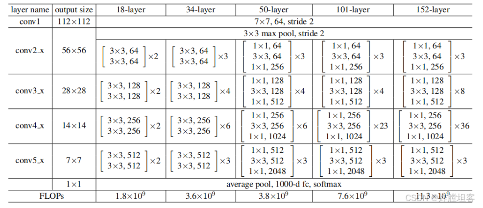

# ClayTeapots_Classify
紫砂壶分类数据集与分类相关代码
# 图片6分类深度学习项目使用说明


使用224x224x3输入，6分类输出
```
{
  "0": "Flower_shape",
  "1": "Lifting_beam",
  "2": "Patterned",
  "3": "Round",
  "4": "Square",
  "5": "background"
}
```
### 实际使用了resnet34框架对图片进行分类


## 项目结构

```
./datasets/
├── train/        # 训练集
│   ├── Round/     # 类别1的图片
│   ├── Square/    # 类别2的图片
│   ├── .../      # 其他类别
│   └── .../      # 其他类别
├── val/          # 验证集（结构同上）
└── test/         # 测试集（结构同上）
```

## 环境要求

```bash
pip install torch torchvision pillow tqdm scikit-learn
```

## 使用方法
### 1. 数据扩充
将指定文件夹中的图片进行数据增强
```bash
python 1data_expansion.py
```
### 2.数据分割
将图片按照7 2 1分割为训练集，验证集和测试集

```bash
python 2splite_data.py
```


### 3. 训练模型

基本训练命令：
```bash
python train.py --model-name resnet34 --epochs 20 --batch-size -1
```

可选参数：
- `--model-name`: 选择模型（resnet34, vgg19, googlenet）
- `--data-dir`: 数据集路径（默认：./split_datasets）
- `--batch-size`: 批次大小（默认：-1）
- `--epochs`: 训练轮数（默认：20）
- `--lr`: 学习率（默认：0.001）
- `--num-workers`: 数据加载线程数（默认：-1）

训练完成后会在output中保存：
- `best_resnet34_model.pt`: 验证集上性能最好的模型
- `final_resnet34_model.pt`: 最后一轮的模型
- `label_mapping.json`: 类别索引与名称的映射

### 4. 验证模型效果

运行脚本会输出指定模型在验证集下的效果,包括Accuracy，Precision，Recall，F1等，详细输出会保存在output/model_effect中
```
val/
  square/
    image1.jpg
    image2.jpg
  round/
    image3.jpg
    image4.jpg
  ...
```
```bash
python val_model.py
```


### 5. 测试并整理大量图片

基本测试命令：
按照默认的测试图片路径将图片在output/classify中按分类文件夹进行放置
```bash
python test.py
```
```angular2html
./output/classify 
├─background
├─Flower_shape
├─Lifting_beam
├─Patterned
├─Round
└─Square

```

可选参数：
- `--model-path`: 选择模型（默认：./output/best_googlenet_model.pt）
- `--data-dir`: 数据集路径（默认：./split_datasets/test）

测试完成后：
- 所有测试图片会被分类并复制到相应的类别文件夹

### 6. 测试单张图片并可视化
将测试的单张图片准确里可视化并保存在output/visulize中，下面提供几张效果图可供查看

```bash
python visualization.py
```


## 代码特点

1. **多模型支持**：支持ResNet34、VGG19和GoogLeNet三种经典网络结构
2. **迁移学习**：使用预训练权重进行微调，提高训练效率
3. **数据增强**：包含随机翻转、旋转等增强操作
4. **进度显示**：使用tqdm库显示训练和测试进度
5. **GPU加速**：自动检测并使用CUDA加速
6. **自动保存**：保存最佳模型和最终模型
7. **智能分类**：自动根据目录结构识别类别

## 注意事项

1. 确保数据集目录结构正确
2. 图片格式支持：PNG、JPG、JPEG
3. 建议使用GPU训练以加快速度
4. 可以通过调整batch_size来适应不同的GPU内存
5. 模型会自动选择可用的设备（CPU或CUDA）
